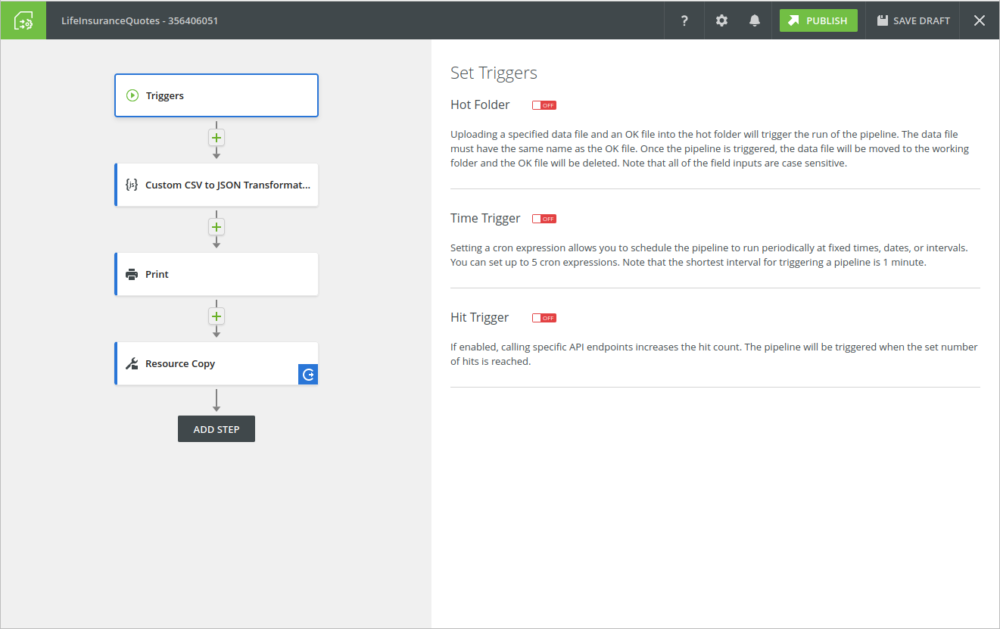
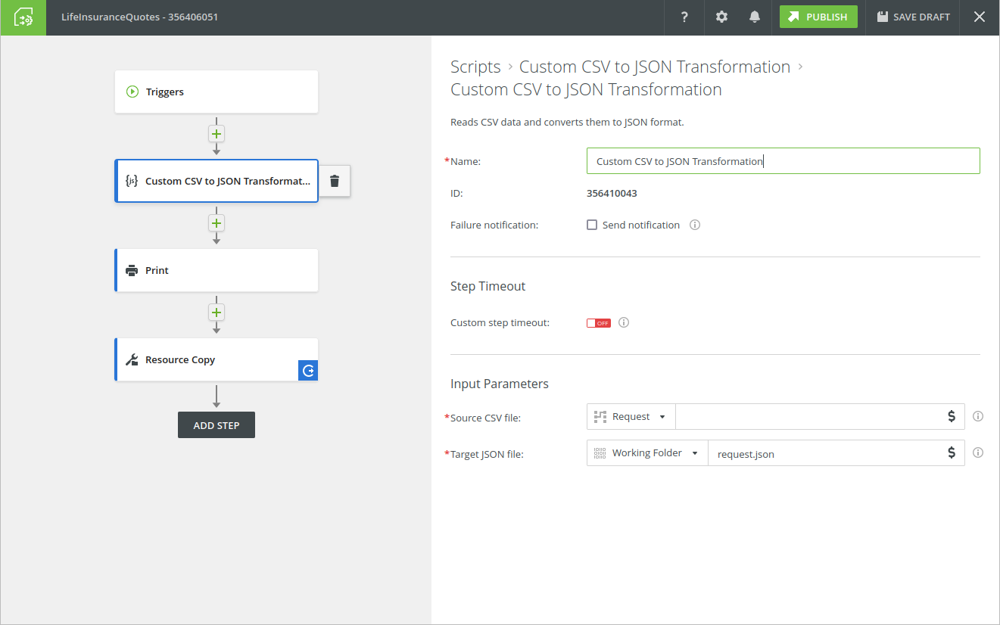
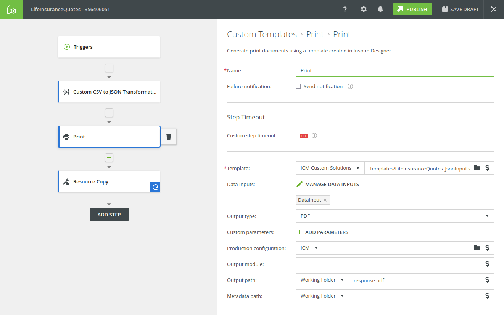
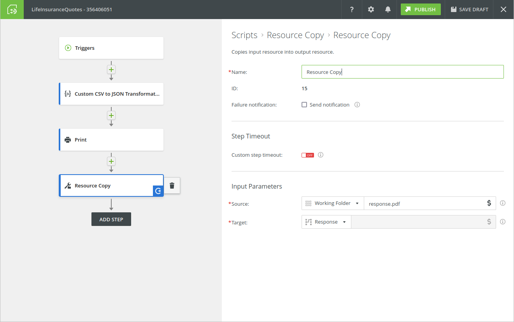

# Csv Transformation Example

## Overview

This is an example of the whole scenario. Here you can see how to build a pipeline
that can be used to accept CSV data in request. The pipeline then transform the data to JSON with custom script
and use a production step to generate PDF from the data input based on the .wfd template.
PDF is returned in response.

## Pre-requisities
Following tools are needed to be installed to be able to build the example modules.
- NodeJS
- Yarn
- [Bobril build](https://github.com/bobril/bbcore)

## Build the script

First one needs to build the csv transformation script.
In commandline switch to the folder `csv-transform-example` and run the
following command:

```
$ bb b
```
As a result, there should be a file a.js in folder dist. This is the javascript
that should be uploaded to Evolve.

## Create the Pipeline

Following pictures illustrate the pipeline.

**Note**: In the "Print" step it is necessary to provide a real path to
the `LifeInsuranceQuote_jsonInput.wfd` file in the `ICM Sample Solutions` folder.

The `DataInput` must point to the `request.json` file in the `Working Folder`.









## The request
Here you can see how the request should look like.

You must replace:
- `YOUR_API_KEY` with the real API key from the Inspire Cloud and
- `YOUR_PIPELINE` with the created pipeline ID.

```
POST /production/v2/onDemandPipelineCustomData/YOUR_PIPELINE_ID HTTP/1.1
Host: neubauer.inspireclouduat.net
Authorization: Bearer YOUR_API_KEY
Content-Type: text/plain
Content-Length: 1294

CustID,CustName,CustMid,CustSur,CustMail,FromMail,CustPhone,FromPhone,Subject,CustGen,CustCompany,CustStreet,CustCity,CustZIP,CustCountry,CustState,CountryLong,Manager,Internet,Phone,Consultant,CustOption,Date,Open,High,Low,Close,Change,LastDate,LastOpen,LastHigh,LastLow,LastClose,LastChange,Initial_Amount,Jan,Feb,Mar,Apr,May,Jun,Jul,Aug,Sep,Oct,Nov,Dec
1,"Johannes","","Planck","jp@example.com","example@example.com",420123456789,420123456789,"Life Insurance Quotes",1,"","Kopernikstrasse 54","Kiel",44612,"D","","Germany","Thomas Müller",1,1,1,1,"21.9.2001","0,761000","0,765210","0,707836","0,757446","-18,91%","28.12.2001","1,022044","1,035114","1,022044","1,032020","2,81%","17000,00","6412,78","6377,56","6204,42","6194,22","6223,57","6201,49","5999,19","5222,12","3787,23","4820,26","5150,97","5160,1",
2,"Elizabeth","","Miles","example@example.com","example@example.com",420123456789,420123456789,"Life Insurance Quotes",2,"Fiberplan AG","Watson Street","Liverpool","SW45AJ","E","Hampshire","United Kingdom","Samuel Ray",0,1,1,5,"3.8.2001","2,079150","2,079150","2,047620","2,066330","1,84%","28.12.2001","1,985710","2,002720","1,982370","1,987260","2,13%","3000,00","2781,3","2660,5","2457,68","2163,41","2101,23","2215,1","2084,79","1916,8","1423,19","1768,96","1900,57","1987,26",
```

## The conversion script description
In this section we will walk through the source code of the script converting CSV to JSON.

The script is in the [src/index.ts](src/index.ts) file.

The script has two parameters - a resource path of the input and output. We use a resource
connectors concept to abstract away from the details of accessing data.
See the documentation for more details.

Every pipeline script must export two methods:
- getDescription
- execute

### getDescription

The `getDescription` provides general information about the script itself - its name, description,
description of the parameters. It is quiet obvious, so see details. Worth to mention could be
the two input parameters - `source` and `target`. Please note, that the `source` type is defined as
`InputResource` - so its value will be defined by editor of the pipeline and it will point to the
source of the CSV data. In our scenario described above it will point to the request data, so the actual
value will be `request://`.

The parameter `target` if of type `OutputResource` and in our scenario it will point to a file in a
working folder, where it can be used by the `Print` step as a DataInput file.

But the script is written in generic way and it doesn't care where will be the actual location of the output.
That is how the concept of resource connectors works.

### execute

The `execute` method contains the main body of the script. First, it takes parameter `source`. Because it is of type
`InputResource`, it means that the actual value is a string containing kind of URI of the input data that can be read.
So the value is accessed with `context.parameters.source as string` piece of code. The URI can be opened
for reading as a *readable* stream with `context.openReadText` method, resulting in:
```typescript
const input = await context.openReadText(context.parameters.source as string);
```

We work with the output data URI in the similar way and open a *writable* stream with it, so we can write data to it:
```typescript
const output = await context.openWriteText(context.parameters.target as string);
```

Note, that we are using `openReadText` instead of just `openRead`. The `openReadText` method
opens stream for reading the input data decoded as a text in UTF-8, not binary.

We use the [stream API](https://developer.mozilla.org/en-US/docs/Web/API/Streams_API)
which is part of Evolve scripting engine. Especially in this example we
use [TransformStream](https://developer.mozilla.org/en-US/docs/Web/API/TransformStream).

There are readilly available `StringToCsvTransformStream` and `JsonToStringTransformStream`
classes in the [evolve-data-transformations](https://www.npmjs.com/package/@quadient/evolve-data-transformations) library.
They help to transform the string input into the stream of CSV events. Our custom transformer (yellow in the picture)
translates the CSV events into the JSON events and then we use the already available class to transform
the JSON events to string (deserialization).


```typescript
await input
    .pipeThrough(new StringToCsvTransformStream())
    .pipeThrough(new CsvCustomTransformStream())
    .pipeThrough(new JsonToStringTransformStream())
    .pipeTo(output);
```

Now we can look on the `CsvCustomTransformStream` more deeply. It extends `TransformStream` and in constructor it
provides object with following 3 methods:

- **`start`** - method called at the beginning of the stream transformation. In our case it produces the beginning of the JSON (in the form of `JSONEvent` objects)

- **`transform`** - method called for every chunk of data. Because of the previous transformers in the chain,
  it receives `CSVEvent` objects and produces `JSONEvent` objects as a result.
  The received object is a first parameter of the method. The second parameter is a controller - object
  which can be used to produce the output data.
  We are making use of a special type of JSON event - `JsonEventType.ANY_VALUE` - this type
  of `JsonEvent` can be used to output the whole
  javascript object, so we don't need to produce low-level Json events for all individual
  objects, all their properties, arrays etc. We just construct a javascript object and put it to the
  output, wrapped with JsonEvent of type `ANY_VALUE`. It means object like this:
  ```typescript
  let myObject = { /** my object properties */ }
  let event = {type: JsonEventType.ANY_VALUE, data: myObject};
  ```
  The event is then sent to output of the transform stream via the `controller` object. This leads to:
  ```typescript
  controller.enqueue({type: JsonEventType.ANY_VALUE, data: obj});
  ```

- **`flush`** - Is called when the transformed stream is fully read, wrapping the end of the JSON output.

The rest of the code is there just to take care of the output file if there is some of the same name already,
covering error states etc.
